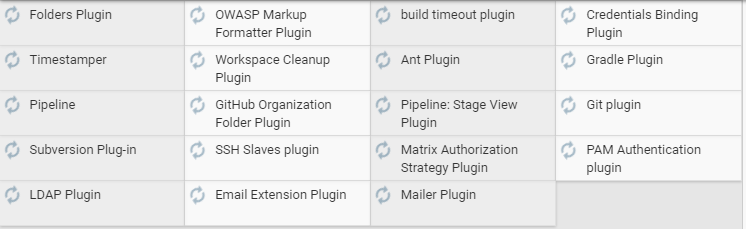
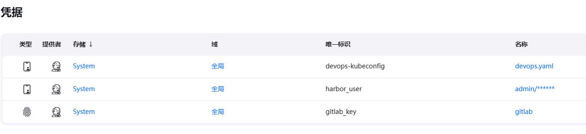
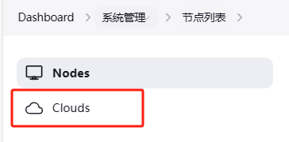
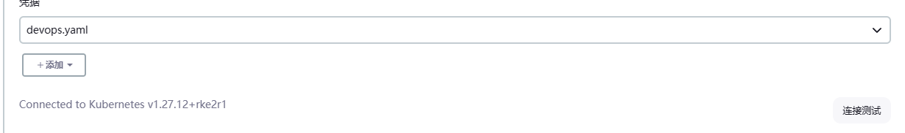
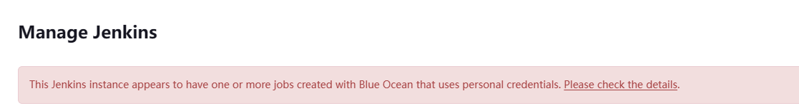

# 启动jenkins

[docker安装jenkins并配置国内插件镜像地址_jenkins国内镜像-CSDN博客](https://blog.csdn.net/qq_41342975/article/details/130394764#:~:text=docker安装jenkins并配置国内插件镜像地址 1 1、拉取 jenkins 镜像 docker  search,5 5、配置插件的国内镜像地址 第一步 更新Update Site 为 https%3A%2F%2Fmirrors.tuna.tsinghua.edu.cn%2Fjenkins%2Fupdates%2Fupdate-center.json )

```shell
sudo yum install wget jq psmisc vim net-tools telnet yum-utils device-mapper-persistent-data lvm2 git -y
sudo yum-config-manager --add-repo https://mirrors.aliyun.com/docker-ce/linux/centos/docker-ce.repo
sudo yum install docker-ce -y 
sudo systemctl enable --now docker

sudo mkdir -p /jenkins/jenkins-data

sudo docker run -d \
	--restart=always  \
   --name jenkins \
   -u root \
   -p 8080:8080 \
   -p 50000:50000 \
   -v /jenkins/jenkins-data:/var/jenkins_home \
   -v /var/run/docker.sock:/var/run/docker.sock \
   jenkins/jenkins
   
# 登录密码 启动容器时对容器做了存储卷的映射，因此容器中“/var/jenkins_home/secrets/initialAdminPassword”文件，对应在主机中的位置为：/tmp/jenkins-data/secrets/initialAdminPassword

sudo cat /jenkins/jenkins-data/secrets/initialAdminPassword

# 买一台阿里云服务器测试
http://8.138.93.181:8080/

sudo docker start jenkins
```


启动的适合不要安装任何插件。启动好了之后，配置一下国内源

Manager Jenknis >> System configuration >> Plugins

Advanced setting >> Update Site :


```shell
https://updates.jenkins.io/update-center.json
==>
https://mirrors.tuna.tsinghua.edu.cn/jenkins/updates/update-center.json
```

第二步

```shell
cd /jenkins/jenkins-data/updates

sed -i 's/https:\/\/updates.jenkins.io\/download/https:\/\/mirrors.tuna.tsinghua.edu.cn\/jenkins/g' default.json  
sed -i 's/https:\/\/www.google.com/https:\/\/www.baidu.com/g' default.json

```

重启jenknis

```shell
sudo docker restart jenkins
```





```shell
Git Parameter
Git Pipeline for Blue Ocean
GitLab
Blue Ocean
Blue Ocean Pipeline Editor
Build with Parameters
Dynamic Extended Choice Parameter
-- Dynamic Parameter Plug-in
Extended Choice Parameter
List Git Branches Parameter
Kubernetes
Kubernetes CLI
Kubernetes Credentials
Image Tag Parameter
Active Choices
```

## 备份

```shell
cd jenkins-data/
tar zcvf jenkins-backup.tar.gz jenkins-data/*
```

# VS code

[用vscode开发Jenkins pipeline - 简书 (jianshu.com)](https://www.jianshu.com/p/eb5abb02ed47)

[在 VS Code 中校验您的 Jenkinsfile](https://www.jenkins.io/zh/blog/2018/11/07/Validate-Jenkinsfile/)

# Gitlab

首先在国内源下载gitlab安装包: 

[Index of /gitlab-ce/yum/el7/ | 清华大学开源软件镜像站 | Tsinghua Open Source Mirror](https://mirrors.tuna.tsinghua.edu.cn/gitlab-ce/yum/el7/)

[Index of /gitlab-ce/yum/el9/ | 清华大学开源软件镜像站 | Tsinghua Open Source Mirror](https://mirrors.tuna.tsinghua.edu.cn/gitlab-ce/yum/el9/)

```shell
# 如果是rocky9
 wget -O gitlab-ce-16.11.0-ce.0.el9.x86_64.rpm https://mirrors.tuna.tsinghua.edu.cn/gitlab-ce/yum/el9/gitlab-ce-16.11.0-ce.0.el9.x86_64.rpm

sudo yum install gitlab-ce-16.11.0-ce.0.el9.x86_64.rpm -y

# 安装完毕后，修改基础配置
sudo vim /etc/gitlab/gitlab.rb

external_url 'http://8.138.89.108'
prometheus['enable'] = false


```

重新加载gitlab配置文件

```shell
sudo gitlab-ctl reconfigure

sudo gitlab-ctl restart

http://8.138.89.108
admin / lYVqDVL29ZJfchdH0eDX3lnmdHKTAxYOmsamXGjw6g0=
```

配置ssh key


# 安装habor

## 安装docker

```shell
# 安装docker
sudo yum install curl wget jq vim net-tools yum-utils device-mapper-persistent-data lvm2 -y
sudo yum-config-manager --add-repo https://mirrors.aliyun.com/docker-ce/linux/centos/docker-ce.repo
sudo yum install docker-ce -y 
sudo systemctl enable --now docker
```

## 下载软件包

[Releases · goharbor/harbor (github.com)](https://github.com/goharbor/harbor/releases)

```shell
wget -O harbor-offline-installer-v2.9.4.tgz https://github.com/goharbor/harbor/releases/download/v2.9.4/harbor-offline-installer-v2.9.4.tgz

# 下不动，用这个链接
wget -O harbor-offline-installer-v2.9.4.tgz  https://mirror.ghproxy.com/https://github.com/goharbor/harbor/releases/download/v2.9.4/harbor-offline-installer-v2.9.4.tgz

tar -xf harbor-offline-installer-v2.9.4.tgz
cd harbor
sudo docker load -i harbor.v2.9.4.tar.gz

# 安装compose
sudo curl -L "https://github.com/docker/compose/releases/download/v2.26.1/docker-compose-$(uname -s)-$(uname -m)" -o /usr/local/bin/docker-compose

# 如果github比较慢
https://mirror.ghproxy.com/https://github.com/docker/compose/releases/download/v2.26.1/docker-compose-linux-x86_64

sudo chmod +x /usr/local/bin/docker-compose
docker-compose -v

# Harbor提供了一个默认的配置文件
cp harbor.yml.tmpl harbor.yml

# 修改配置
vim harbor.yml
# --------------
hostname: 8.138.161.243
# https:
#  # https port for harbor, default is 443
#  port: 443
#  # The path of cert and key files for nginx
#  certificate: /your/certificate/path
#  private_key: /your/private/key/path
data_volume: /data/harbor

# 创建habor数据目录
sudo mkdir -p /data/harbor
# 检查
sudo ./prepare
# 安装
sudo ./install.sh

sdo docker-compose restart

http://8.138.161.243
```

# Docker 使用harbor

```shell
sudo vi /etc/docker/daemon.json
{
	"exec-opts":["native.cgroupdriver=systemd"],
	"insecure-registries":["https://8.138.101.135" ]
}
sudo systemctl daemon-reload
sudo systemctl restart docker

sudo docker login http://8.138.161.243

```

 修改/etc/containerd/config.toml，添加以下内容：

```shell
[plugins."io.containerd.grpc.v1.cri".registry.mirrors."registry:80"]
endpoint = ["http://registry:80"]

[plugins."io.containerd.grpc.v1.cri".registry]
[plugins."io.containerd.grpc.v1.cri".registry.mirrors]
[plugins."io.containerd.grpc.v1.cri".registry.mirrors."8.138.101.135"]
endpoint = ["https://8.138.101.135/"]

作者：overstarry
链接：https://juejin.cn/post/7094996051408633863
来源：稀土掘金
著作权归作者所有。商业转载请联系作者获得授权，非商业转载请注明出处。
# 重启containerd服务
sudo systemctl restart containerd


```


# 部署Rancher

**阿里云的机器，安装rancher前需要**

```shell
# 所有节点关闭防火墙、selinux、dnsmasq、swap。服务器配置如下：
systemctl disable --now firewalld 

setenforce 0
sed -i 's#SELINUX=enforcing#SELINUX=disabled#g' /etc/sysconfig/selinux
sed -i 's#SELINUX=enforcing#SELINUX=disabled#g' /etc/selinux/config
yum install wget jq psmisc vim net-tools telnet yum-utils device-mapper-persistent-data lvm2 git -y

yum-config-manager --add-repo https://mirrors.aliyun.com/docker-ce/linux/centos/docker-ce.repo
sudo modprobe overlay
sudo modprobe br_netfilter
sudo modprobe iptable_filter
sudo modprobe iptable_nat

#hostnamectl set-hostname rancher

cat <<EOF | sudo tee /etc/sysctl.d/99-kubernetes-cri.conf
net.bridge.bridge-nf-call-iptables  = 1
net.ipv4.ip_forward                 = 1
net.bridge.bridge-nf-call-ip6tables = 1
EOF
sudo sysctl --system

yum install docker-ce -y 
systemctl enable --now docker

echo GRUB_CMDLINE_LINUX=\"cgroup_enable=cpu\" >> /etc/default/grub
grub2-mkconfig
reboot
```

启动rancher

```shell
sudo mkdir -p /data/rancher
sudo docker pull registry.cn-hangzhou.aliyuncs.com/rancher/rancher-agent:v2.8.2
sudo docker pull registry.cn-hangzhou.aliyuncs.com/rancher/rancher:v2.8.2

sudo docker run -d --name rancher --restart=unless-stopped --privileged \
-v /data/rancher:/var/lib/rancher -p 443:443 -p 80:80 \
-e CATTLE_AGENT_IMAGE="registry.cn-hangzhou.aliyuncs.com/rancher/rancher-agent:v2.8.2" \
registry.cn-hangzhou.aliyuncs.com/rancher/rancher:v2.8.2

https://8.138.161.64
admin NMiGmrLGMsFpsGig
```

## 配置好国内源

[如何在国内使用 Rancher | Rancher文档](https://docs.rancher.cn/docs/rancher2/best-practices/use-in-china/_index/)

```shell
# global setting >> system-default-registry =>
registry.cn-hangzhou.aliyuncs.com
```

## 准备K8s机器

在机器上安装docker，关闭selinux等

```shell
# 所有节点关闭防火墙、selinux、dnsmasq、swap。服务器配置如下：
systemctl disable --now firewalld 

setenforce 0
sed -i 's#SELINUX=enforcing#SELINUX=disabled#g' /etc/sysconfig/selinux
sed -i 's#SELINUX=enforcing#SELINUX=disabled#g' /etc/selinux/config
yum install wget jq psmisc vim net-tools telnet yum-utils device-mapper-persistent-data lvm2 git -y

yum-config-manager --add-repo https://mirrors.aliyun.com/docker-ce/linux/centos/docker-ce.repo
sudo modprobe overlay
sudo modprobe br_netfilter
sudo modprobe iptable_filter
sudo modprobe iptable_nat

#hostnamectl set-hostname rancher

cat <<EOF | sudo tee /etc/sysctl.d/99-kubernetes-cri.conf
net.bridge.bridge-nf-call-iptables  = 1
net.ipv4.ip_forward                 = 1
net.bridge.bridge-nf-call-ip6tables = 1
EOF
sudo sysctl --system

yum install docker-ce -y 
systemctl enable --now docker

echo GRUB_CMDLINE_LINUX=\"cgroup_enable=cpu\" >> /etc/default/grub
grub2-mkconfig
reboot

```

## 创建集群

拷贝rancher页面上的命令，分半到node上运行

```text
The cluster must be up and running with Linux etcd, control plane, and worker nodes before the registration command for adding Windows workers will display.
```

```shell
# master
curl --insecure -fL https://8.138.104.73/system-agent-install.sh | sudo  sh -s - --server https://8.138.104.73 --label 'cattle.io/os=linux' --token p7h7cxrgsw87r9q6l7k4nkhcg5cnqmqbqwm6vzrsg5689zfflbxttc --ca-checksum 4bf22c49d46e6a272f413090749659b7df7779c8f8d7e67d6fd8c351d0a470b0 --etcd --controlplane --worker

# worker
curl --insecure -fL https://8.138.104.73/system-agent-install.sh | sudo  sh -s - --server https://8.138.104.73 --label 'cattle.io/os=linux' --token p7h7cxrgsw87r9q6l7k4nkhcg5cnqmqbqwm6vzrsg5689zfflbxttc --ca-checksum 4bf22c49d46e6a272f413090749659b7df7779c8f8d7e67d6fd8c351d0a470b0 --worker

curl --insecure -fL https://8.138.104.73/system-agent-install.sh | sudo  sh -s - --server https://8.138.104.73 --label 'cattle.io/os=linux' --token p7h7cxrgsw87r9q6l7k4nkhcg5cnqmqbqwm6vzrsg5689zfflbxttc --ca-checksum 4bf22c49d46e6a272f413090749659b7df7779c8f8d7e67d6fd8c351d0a470b0 --worker

# 查看日志
tail -f /var/log/message

```

# 配置Jekins

## 配置ssh host_know

管理 >> 安全

## 添加jekins credential



kubconfig是secret file

haboruser 是user and  password

gitlab_key是ssh and private key


## 指定的k8s 节点才可以build

```shell
kubectl label node worker-0 build=true
```

## 添加k8s集群到jenkins



添加一个新的cloud。选择前面的kubconfig文件即可



## 这里有一个安全风险，为了测试我们重新启用

## 浪费我一天的时间！！！！！！！！！！，一定要看清页面上的字啊！！！！！！！！！！

## 改了也没毛用啊！！！只是凭证可以创建出来了，但是哪个editor一样不行！！！



[Removing Blue Ocean credentials security vulnerability (cloudbees.com)](https://docs.cloudbees.com/docs/cloudbees-ci-kb/latest/client-and-managed-controllers/bee-17022)

Alternatively, this property can be set up through the `Manage Jenkins -> Script Console` from your instance. You can use a `Cluster Operation` to enable or disable this property in multiple controllers at one time. Use the following scripts:

**Enabling the property:**

```
System.setProperty(io.jenkins.blueocean.rest.impl.pipeline.credential.BlueOceanCredentialsProvider.class.getName() + ".enabled", "true")
```

**Disabling the property:**

```
System.clearProperty(io.jenkins.blueocean.rest.impl.pipeline.credential.BlueOceanCredentialsProvider.class.getName() + ".enabled")
```

This process does not require a restart, but the change does not persist if you restart the instance. Choose the most appropriate option for your use case.

## 直接打开一个编辑器

http://8.138.126.21:8080/blue/organizations/jenkins/pipeline-editor/

# 自动构建Java应用

示例项目： https://gitee.com/dukuan/spring-boot-project.git 

