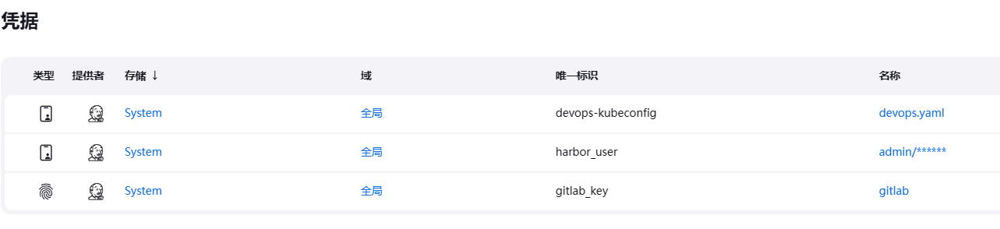
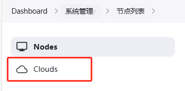
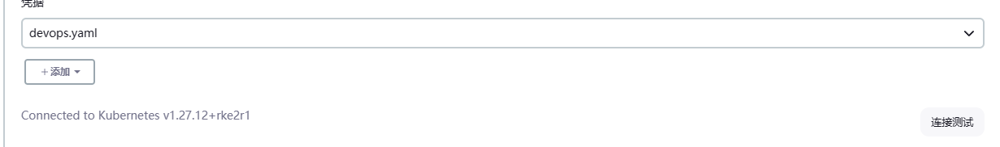

# Jenknis
## 配置ssh host_know

管理 >> 安全

## 添加jekins credential



kubconfig是secret file

haboruser 是user and  password

gitlab_key是ssh and private key


## 指定的k8s 节点才可以build

```shell
kubectl label node worker-0 build=true
```

## 添加k8s集群到jenkins



添加一个新的cloud。选择前面的kubconfig文件即可



# Rancher 和 K8s
Rancher可以直接使用，K8s机器已经准备好，只需要登录Rancher，配置好国内源，

[如何在国内使用 Rancher | Rancher文档](https://docs.rancher.cn/docs/rancher2/best-practices/use-in-china/_index/)

```shell
# global setting >> system-default-registry =>
registry.cn-hangzhou.aliyuncs.com
```

创建集群即可

# Gitlab
全新安装，可以直接使用

# Harbor
全新安装，可以直接使用
